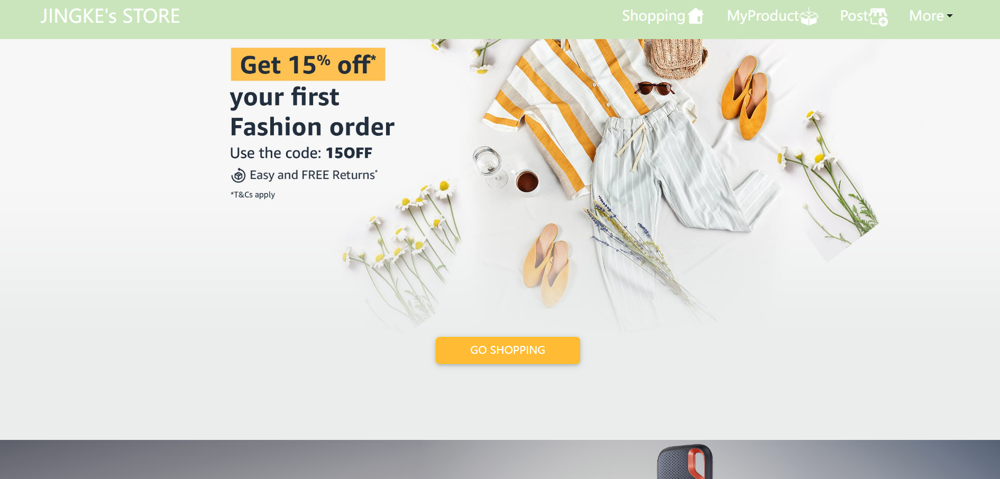
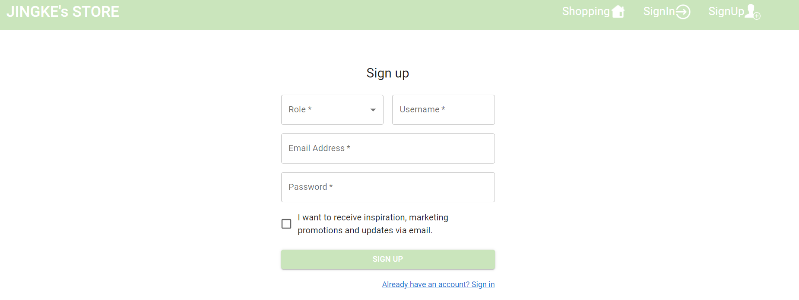
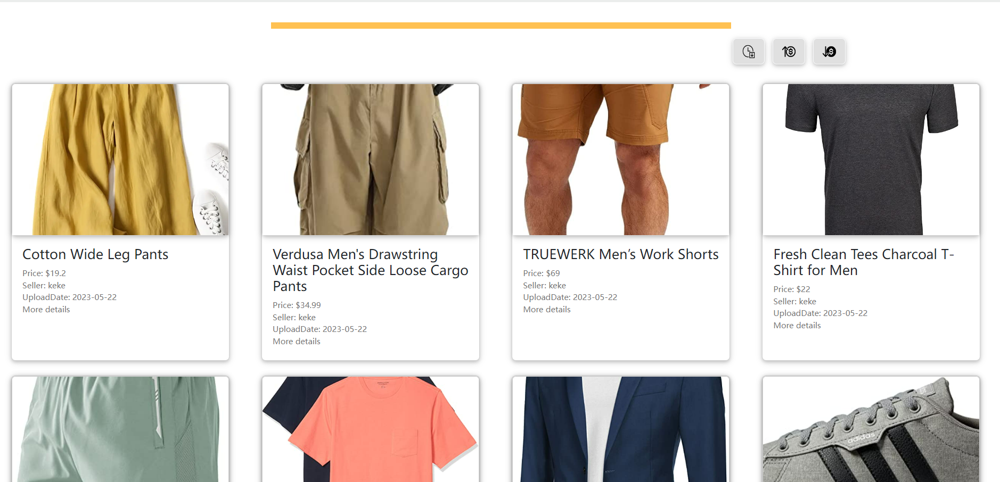
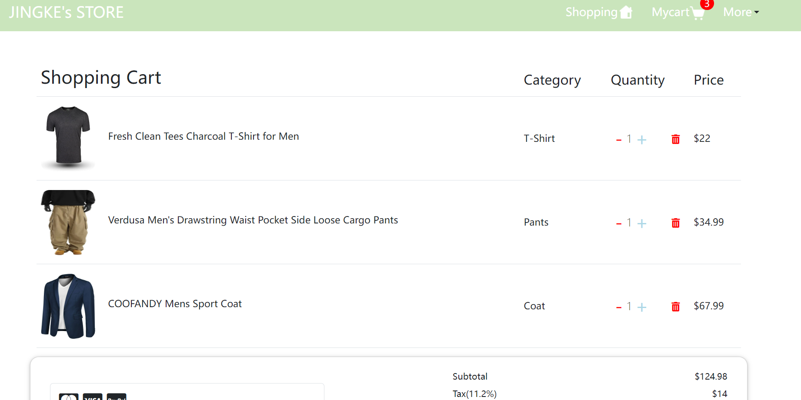
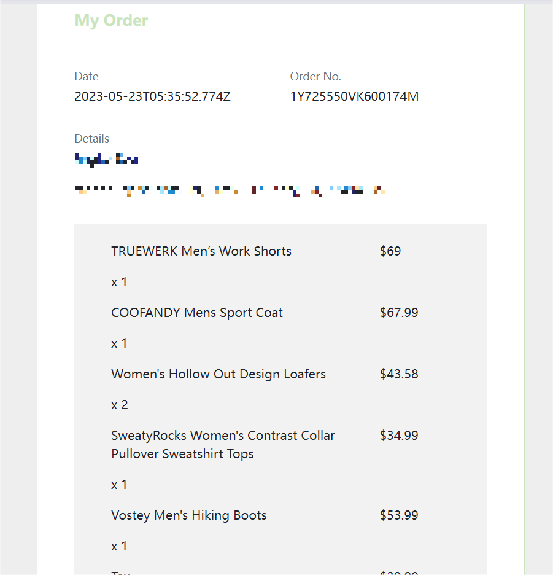
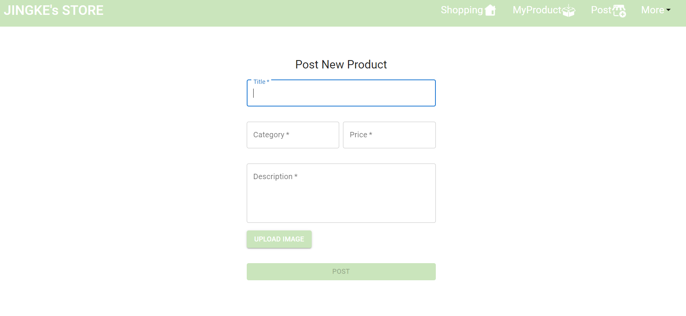
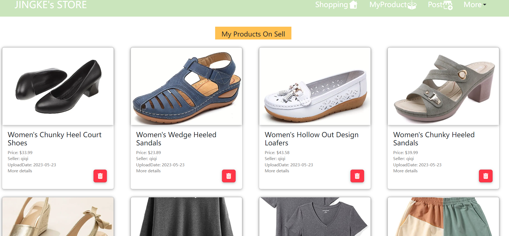
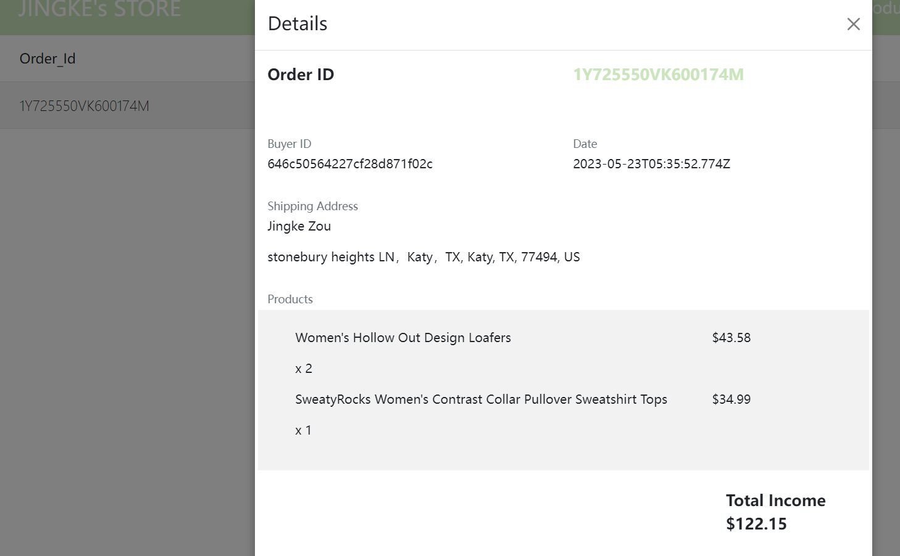

# react-estore application
This is a MERN application where you can register as a buyer or seller. You Can buy/post anything you like on it. Besides, you may need a Paypal bussiness account and configure it if you want to be a seller.
[ESTORE Link](http://zjjkee.info)

## Skills Used:
   ***Backend***
   
 - Nodejs,  Mongodb
  , Express
  , Passport.js
  , Multer
  
 ***Frontend***
 
 - React Js
 , Redux
 , Axios
 , Material UI
 
## ScreenShot
### Public

Index Page

Register Page

### Buyer Account

Cart Page/Checkout Page

Orders Page. Seeing all orders made by the buyer. 

### Seller Account

Post Page, where you post new product.

Products the seller has posted.

Orders regarding the seller that have been made by others buyers.

